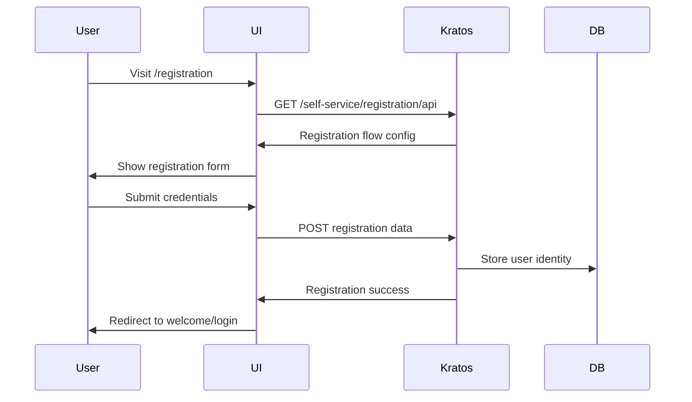
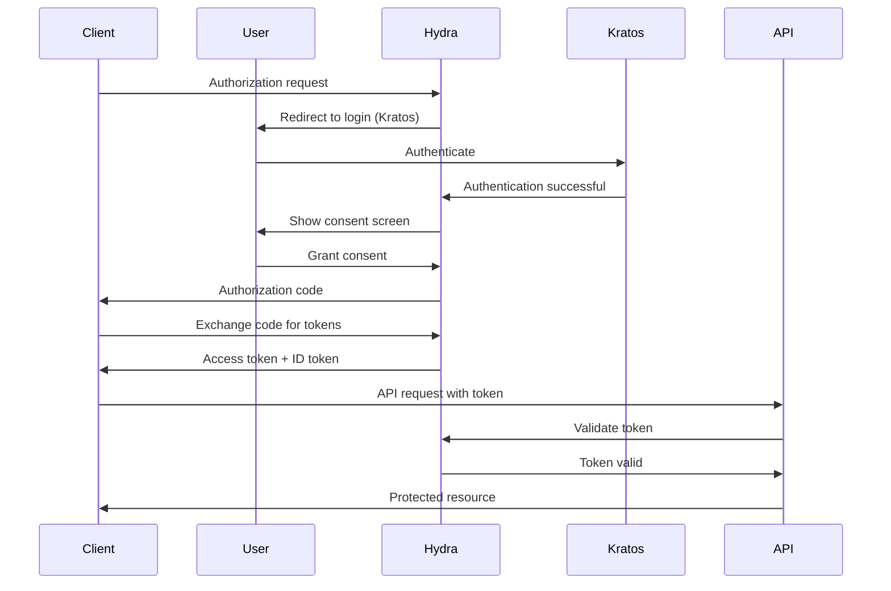
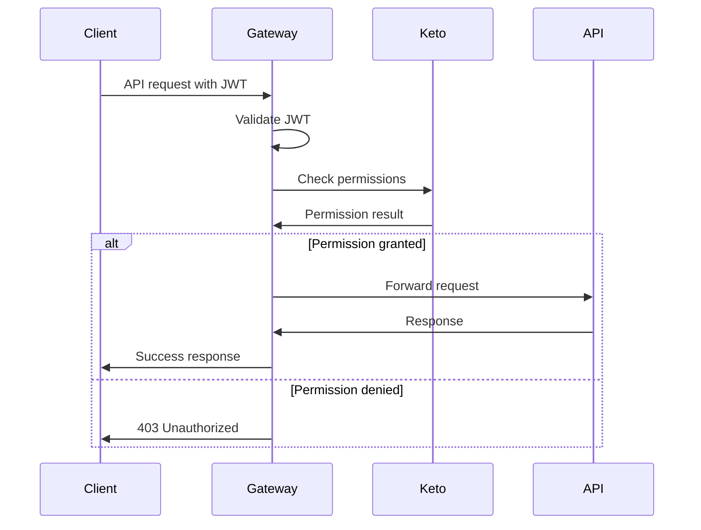

# Ory Stack Architecture

This document describes the architecture and integration patterns for the complete Ory authentication and authorization stack.

## System Overview

The Ory Stack provides a modern, standards-based approach to identity management, authentication, and authorization using three core components:

- **Ory Kratos** - Identity and user management
- **Ory Hydra** - OAuth 2.0 and OpenID Connect provider  
- **Ory Keto** - Fine-grained authorization server

## Architecture Diagram

```
┌─────────────────┐    ┌─────────────────┐    ┌─────────────────┐
│   Frontend      │    │   API Gateway   │    │   Backend       │
│   Application   │────│     APISIX      │────│   Services      │
│  (React/Vue/    │    │                 │    │                 │
│   Angular)      │    │  • JWT Validation│    │ • Microservices │
└─────────────────┘    │  • Rate Limiting │    │ • REST APIs     │
         │              │  • Load Balancer │    │ • gRPC Services │
         │              └─────────────────┘    └─────────────────┘
         │                        │                      │
         │                        │                      │
    ┌─────────────────┐          │            ┌─────────────────┐
    │  Self-Service   │          │            │   PostgreSQL    │
    │     UI          │          │            │   Database      │
    │                 │          │            │                 │
    │ • Registration  │          │            │ • User Data     │
    │ • Login/Logout  │          │            │ • OAuth Clients │
    │ • Profile Mgmt  │          │            │ • Permissions   │
    │ • Recovery      │          │            └─────────────────┘
    └─────────────────┘          │
              │                  │
              │                  │
    ┌─────────────────┐    ┌───────────┼───────────┐
    │  Ory Kratos     │    │           │           │
    │  (Identity)     │────┤           │           │
    │                 │    │           │           │
    │ • User Profiles │    │   ┌─────────────────┐ │   ┌─────────────────┐
    │ • Authentication│    │   │   Ory Hydra     │ │   │    Ory Keto     │
    │ • Self-Service  │    │   │  (OAuth/OIDC)   │─┼───│ (Authorization) │
    │ • MFA/2FA       │    │   │                 │ │   │                 │
    └─────────────────┘    │   │ • OAuth 2.0     │ │   │ • RBAC/ABAC     │
                           │   │ • OpenID Connect│ │   │ • Relation Tuples│
                           │   │ • JWT Tokens    │ │   │ • Policy Engine │
                           │   └─────────────────┘ │   └─────────────────┘
                           │                       │
                           └───────────────────────┘
```

## Component Details

### Ory Kratos - Identity Management

**Purpose**: Manages user identities, registration, login, and profile management.

**Key Features**:
- Self-service user registration and login
- Multi-factor authentication (TOTP, WebAuthn, SMS)
- Account recovery and email verification
- Flexible identity schemas
- Password breach detection
- Social login integration

**API Endpoints**:
- **Public API** (4433): Self-service flows for users
- **Admin API** (4434): Administrative operations

**Integration Points**:
- Issues sessions for authenticated users
- Integrates with Hydra for OAuth consent flows
- Stores user profiles and credentials in PostgreSQL

### Ory Hydra - OAuth 2.0 & OpenID Connect

**Purpose**: Provides OAuth 2.0 and OpenID Connect functionality for API authorization.

**Key Features**:
- OAuth 2.0 authorization server
- OpenID Connect certified implementation
- JWT and opaque token support
- Client credentials management
- Consent and login delegation
- Token introspection and revocation

**API Endpoints**:
- **Public API** (4444): OAuth/OIDC endpoints for clients
- **Admin API** (4445): Client and token management

**OAuth 2.0 Flows Supported**:
- Authorization Code Flow (recommended for web apps)
- Client Credentials Flow (for service-to-service)
- Implicit Flow (legacy, not recommended)
- Resource Owner Password Credentials (legacy)

**Integration Points**:
- Delegates login to Kratos
- Issues JWT tokens for API access
- Provides token introspection for API gateways

### Ory Keto - Authorization Server

**Purpose**: Implements fine-grained authorization based on relations and policies.

**Key Features**:
- Relationship-based access control
- Google Zanzibar-inspired permission model
- Policy-as-code authorization
- RESTful permission checking
- Namespace-based organization
- Scalable permission evaluation

**API Endpoints**:
- **Read API** (4466): Permission checking and relation queries
- **Write API** (4467): Relation tuple management

**Permission Model**:
```
namespace:object#relation@subject
```

Example: `files:document-1#viewer@user:alice`

**Integration Points**:
- Checks permissions for API requests
- Integrates with application authorization logic
- Stores relation tuples in PostgreSQL

## Authentication Flow

### 1. User Registration Flow



### 2. OAuth 2.0 Authorization Code Flow



### 3. API Authorization Flow



## Security Architecture

### Token Security

**JWT Token Structure**:
```json
{
  "iss": "http://hydra:4444",
  "sub": "user-uuid",
  "aud": ["api-client"],
  "exp": 1640995200,
  "iat": 1640991600,
  "scope": "openid profile email",
  "client_id": "demo-client"
}
```

**Token Validation**:
- Signature verification using RS256/ES256
- Expiration time checking
- Audience and issuer validation
- Scope verification for API access

### Session Security

**Kratos Sessions**:
- HTTP-only secure cookies
- CSRF protection
- Session timeout configuration
- Device fingerprinting
- IP address validation

### Database Security

**Data Encryption**:
- Passwords hashed with bcrypt
- Sensitive data encrypted at rest
- TLS for database connections
- Regular security updates

## Integration Patterns

### 1. API Gateway Integration

**APISIX Configuration**:
```yaml
plugins:
  oauth:
    discovery: http://hydra:4444/.well-known/openid_configuration
    bearer_only: true
    introspection_endpoint: http://hydra:4445/admin/oauth2/introspect
```

**Features**:
- JWT token validation
- Automatic token refresh
- Rate limiting per client
- Request/response transformation

### 2. Microservices Integration

**Service Authentication**:
- Client credentials flow for service-to-service
- JWT token propagation
- Service mesh integration (Istio, Linkerd)
- Distributed tracing support

**Authorization Patterns**:
- Centralized policy evaluation via Keto
- Distributed authorization caching
- Permission inheritance and delegation
- Audit logging for compliance

### 3. Frontend Integration

**Single Page Applications**:
- Authorization Code Flow with PKCE
- Silent token refresh
- Secure token storage
- CORS configuration

**Mobile Applications**:
- Native OAuth 2.0 flows
- Biometric authentication
- Device registration
- Push notification integration

## Deployment Architecture

### Container Orchestration

**Docker Compose** (Development):
```yaml
services:
  postgres: # Shared database
  kratos:   # Identity management
  hydra:    # OAuth provider  
  keto:     # Authorization
  apisix:   # API gateway
  etcd:     # Configuration store
```

**Kubernetes** (Production):
- Helm charts for deployment
- Horizontal pod autoscaling
- Service mesh integration
- Persistent volume claims
- ConfigMap and Secret management

### High Availability

**Database**:
- PostgreSQL clustering
- Read replicas for scaling
- Backup and disaster recovery
- Connection pooling

**Services**:
- Multiple replicas per service
- Load balancing with health checks
- Circuit breaker patterns
- Graceful shutdown handling

### Monitoring and Observability

**Metrics**:
- Prometheus metrics collection
- Custom business metrics
- Performance monitoring
- Error rate tracking

**Logging**:
- Structured JSON logging
- Centralized log aggregation
- Audit trail maintenance
- Security event monitoring

**Tracing**:
- Distributed request tracing
- Performance bottleneck identification
- Cross-service dependency mapping
- Root cause analysis

## Performance Considerations

### Scalability

**Horizontal Scaling**:
- Stateless service design
- Database connection pooling  
- Redis for session storage
- CDN for static assets

**Caching Strategies**:
- Token caching at gateway
- Permission result caching
- User profile caching
- Configuration caching

### Optimization

**Database Optimization**:
- Proper indexing strategy
- Query optimization
- Connection pool tuning
- Read/write splitting

**Network Optimization**:
- HTTP/2 and gRPC usage
- Connection keep-alive
- Compression enablement
- Regional deployment

This architecture provides a robust, scalable, and secure foundation for modern authentication and authorization requirements without the complexity of legacy protocols.
