# OAuth 2.0 Flow Diagrams - Visual Reference

This document contains additional visual diagrams and flow charts for OAuth 2.0 flows to complement the main documentation.

## Flow Selection Decision Tree

```mermaid
flowchart TD
    Start([Start: Choose OAuth Flow]) --> Question1{Is this for machine-to-machine communication?}
    
    Question1 -->|Yes| ClientCreds[Client Credentials Flow]
    Question1 -->|No| Question2{Can the client securely store secrets?}
    
    Question2 -->|Yes| Question3{Is user interaction required?}
    Question2 -->|No| Question4{Is this a device with limited input?}
    
    Question3 -->|Yes| AuthCode[Authorization Code Flow]
    Question3 -->|No| ClientCreds
    
    Question4 -->|Yes| DeviceFlow[Device Authorization Flow]
    Question4 -->|No| PKCE[Authorization Code + PKCE]
    
    AuthCode --> Secure1[✅ Most Secure Option]
    PKCE --> Secure2[✅ Secure for Public Clients]
    ClientCreds --> Secure3[✅ Good for Services]
    DeviceFlow --> Secure4[✅ Good for IoT/TV]
    
    classDef recommended fill:#e1f5fe,stroke:#01579b,stroke-width:2px
    classDef secure fill:#e8f5e8,stroke:#2e7d32,stroke-width:2px
    
    class AuthCode,PKCE,ClientCreds,DeviceFlow recommended
    class Secure1,Secure2,Secure3,Secure4 secure
```

## OAuth 2.0 Ecosystem Overview

```mermaid
graph TB
    subgraph "OAuth 2.0 Ecosystem"
        subgraph "Authorization Server"
            AS[Authorization Server<br/>• Issues tokens<br/>• Validates clients<br/>• Manages consent]
            AuthEndpoint[Authorization Endpoint<br/>/oauth2/auth]
            TokenEndpoint[Token Endpoint<br/>/oauth2/token]
            IntrospectEndpoint[Introspection Endpoint<br/>/oauth2/introspect]
            RevokeEndpoint[Revocation Endpoint<br/>/oauth2/revoke]
        end
        
        subgraph "Resource Server"
            RS[Resource Server<br/>• Validates tokens<br/>• Serves protected resources<br/>• Enforces scopes]
            API1[API Endpoint 1]
            API2[API Endpoint 2]
            API3[API Endpoint N]
        end
        
        subgraph "Clients"
            WebApp[Web Application<br/>Authorization Code]
            SPA[Single Page App<br/>Auth Code + PKCE]
            Mobile[Mobile App<br/>Auth Code + PKCE]
            Service[Backend Service<br/>Client Credentials]
            Device[IoT Device<br/>Device Flow]
        end
        
        subgraph "Users"
            User[Resource Owner<br/>End User]
        end
    end
    
    User -.-> WebApp
    User -.-> SPA
    User -.-> Mobile
    User -.-> Device
    
    WebApp --> AuthEndpoint
    SPA --> AuthEndpoint
    Mobile --> AuthEndpoint
    Device --> TokenEndpoint
    Service --> TokenEndpoint
    
    WebApp --> TokenEndpoint
    SPA --> TokenEndpoint
    Mobile --> TokenEndpoint
    
    WebApp --> API1
    SPA --> API2
    Mobile --> API3
    Service --> API1
    Device --> API2
    
    RS --> IntrospectEndpoint
    
    classDef server fill:#ffecb3,stroke:#ff8f00,stroke-width:2px
    classDef client fill:#e1f5fe,stroke:#01579b,stroke-width:2px
    classDef user fill:#f3e5f5,stroke:#7b1fa2,stroke-width:2px
    classDef endpoint fill:#fff3e0,stroke:#ef6c00,stroke-width:1px
    
    class AS,RS server
    class WebApp,SPA,Mobile,Service,Device client
    class User user
    class AuthEndpoint,TokenEndpoint,IntrospectEndpoint,RevokeEndpoint,API1,API2,API3 endpoint
```

## Token Lifecycle Management

## Authorization Code Flow with PKCE - Detailed

## Security Threat Model

## PKCE Security Enhancement

```mermaid
flowchart TD
    subgraph insecure ["❌ Without PKCE (Insecure)"]
        direction TB
        A1[Mobile App] 
        B1[Auth Server]
        X[😈 Malicious App]
        
        A1 -->|1. Authorization Request| B1
        B1 -->|2. Authorization Code| A1
        A1 -->|3. Exchange Code| B1
        B1 -->|4. Access Token| A1
        
        X -.->|Intercepts Code| A1
        X -.->|Uses Same Code| B1
        B1 -.->|🚨 Token Stolen| X
    end
    
    subgraph secure ["✅ With PKCE (Secure)"]
        direction TB
        A2[Mobile App]
        B2[Auth Server]
        Y[😈 Malicious App]
        CV[code_verifier<br/>Random String]
        CC[code_challenge<br/>SHA256 Hash]
        
        A2 --> CV
        CV -->|SHA256| CC
        A2 -->|1. Auth Request + code_challenge| B2
        B2 -->|2. Authorization Code| A2
        A2 -->|3. Code + code_verifier| B2
        B2 -->|4. Verify Hash Match| B2
        B2 -->|5. ✅ Access Token| A2
        
        Y -.->|Intercepts Code| A2
        Y -.->|❌ No code_verifier| B2
        B2 -.->|🛡️ Request Rejected| Y
    end
    
    classDef insecureNode fill:#ffebee,stroke:#d32f2f,stroke-width:2px
    classDef secureNode fill:#e8f5e8,stroke:#2e7d32,stroke-width:2px
    classDef threatNode fill:#fff3e0,stroke:#f57c00,stroke-width:2px
    classDef pkceNode fill:#e3f2fd,stroke:#1976d2,stroke-width:2px
    
    class A1,B1 insecureNode
    class A2,B2 secureNode
    class X,Y threatNode
    class CV,CC pkceNode
```

## Token Types and Usage

```mermaid
flowchart TD
    subgraph tokens ["🎫 OAuth 2.0 Tokens"]
        AT["🔑 Access Token<br/>• Short-lived (15-60 min)<br/>• Bearer token<br/>• API access"]
        RT["🔄 Refresh Token<br/>• Long-lived (days/months)<br/>• Secure storage required<br/>• Token renewal"]
        IDT["🆔 ID Token (OIDC)<br/>• User identity claims<br/>• JWT format<br/>• Authentication proof"]
    end
    
    subgraph formats ["📋 Token Formats"]
        JWT["📜 JWT Tokens<br/>• Self-contained<br/>• Cryptographically signed<br/>• Stateless validation"]
        Opaque["🔒 Opaque Tokens<br/>• Random strings<br/>• Introspection required<br/>• Centralized validation"]
    end
    
    subgraph scenarios ["🎯 Usage Scenarios"]
        API["🌐 API Access<br/>Authorization: Bearer {token}"]
        Refresh["♻️ Token Renewal<br/>grant_type=refresh_token"]
        UserInfo["👤 User Information<br/>JWT claims or /userinfo"]
    end
    
    %% Token to Format relationships
    AT --> JWT
    AT --> Opaque
    RT --> Opaque
    IDT --> JWT
    
    %% Token to Usage relationships
    AT --> API
    RT --> Refresh
    IDT --> UserInfo
    
    %% Additional relationships
    JWT -.-> API
    Opaque -.-> API
    
    classDef tokenStyle fill:#e3f2fd,stroke:#1976d2,stroke-width:3px
    classDef formatStyle fill:#f3e5f5,stroke:#7b1fa2,stroke-width:2px
    classDef usageStyle fill:#e8f5e8,stroke:#2e7d32,stroke-width:2px
    
    class AT,RT,IDT tokenStyle
    class JWT,Opaque formatStyle
    class API,Refresh,UserInfo usageStyle
```

---

## Implementation Checklist

### Authorization Server Implementation
- [ ] Secure random token generation
- [ ] HTTPS enforcement
- [ ] PKCE support for public clients
- [ ] Proper redirect URI validation
- [ ] Rate limiting on token endpoints
- [ ] Comprehensive audit logging
- [ ] Token introspection endpoint
- [ ] Token revocation endpoint

### Client Implementation
- [ ] Secure token storage
- [ ] PKCE implementation (public clients)
- [ ] State parameter validation
- [ ] Proper error handling
- [ ] Token refresh logic
- [ ] Secure redirect handling
- [ ] XSS protection measures

### Resource Server Implementation
- [ ] Token signature verification
- [ ] Scope validation
- [ ] Token introspection (opaque tokens)
- [ ] Rate limiting per client
- [ ] Comprehensive request logging
- [ ] Proper error responses

---

*This visual reference complements the detailed OAuth 2.0 flows documentation. For implementation examples, see the main [OAuth 2.0 Flows Guide](oauth2-flows.md).*
