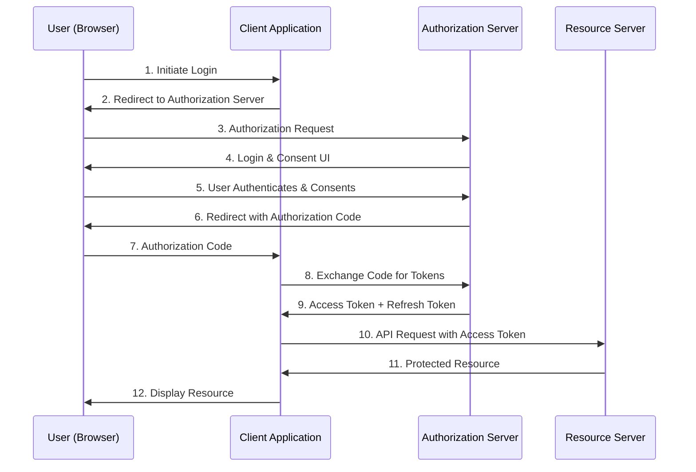
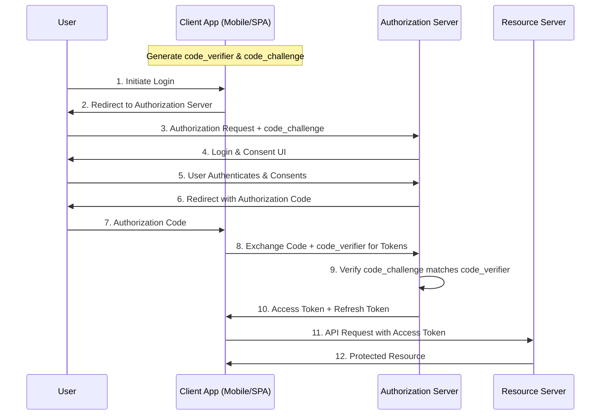
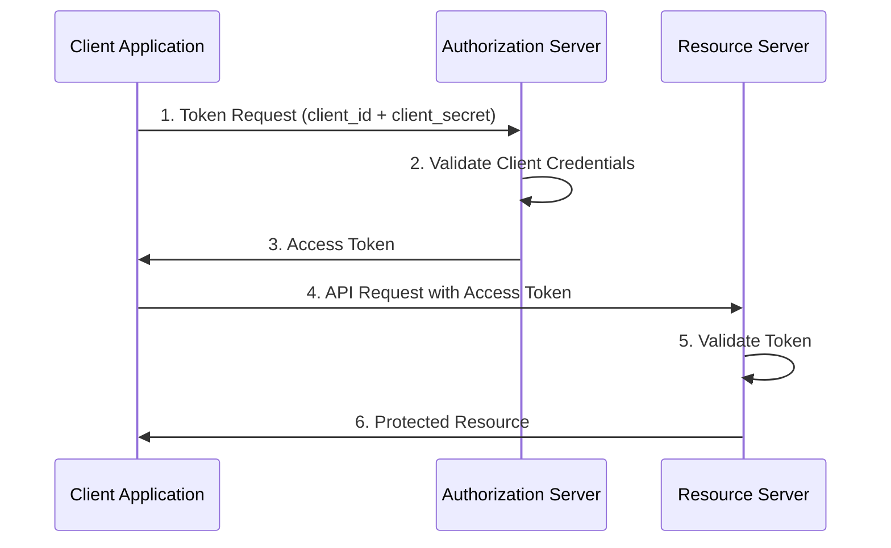
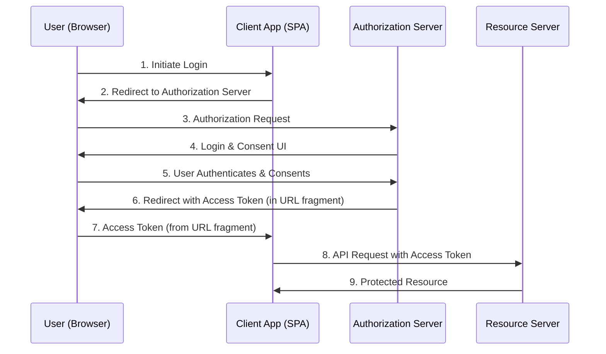
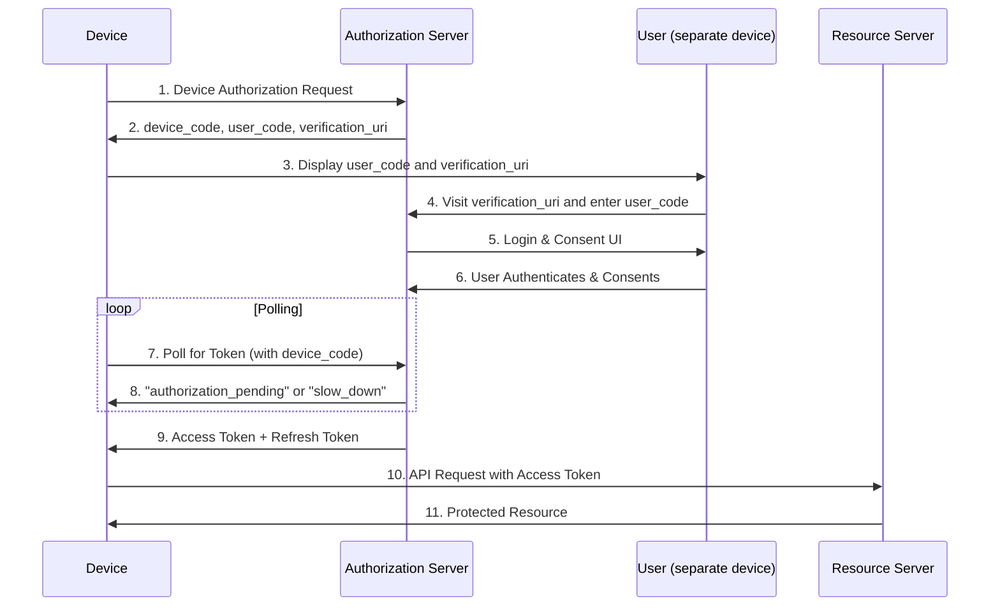
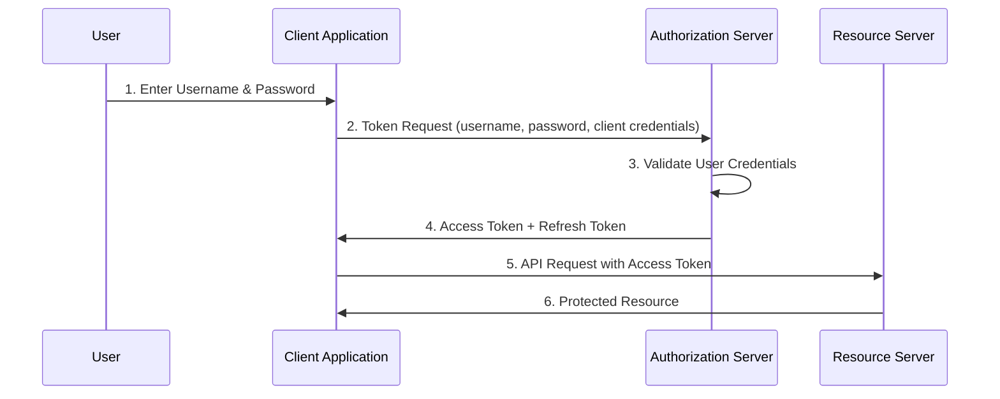
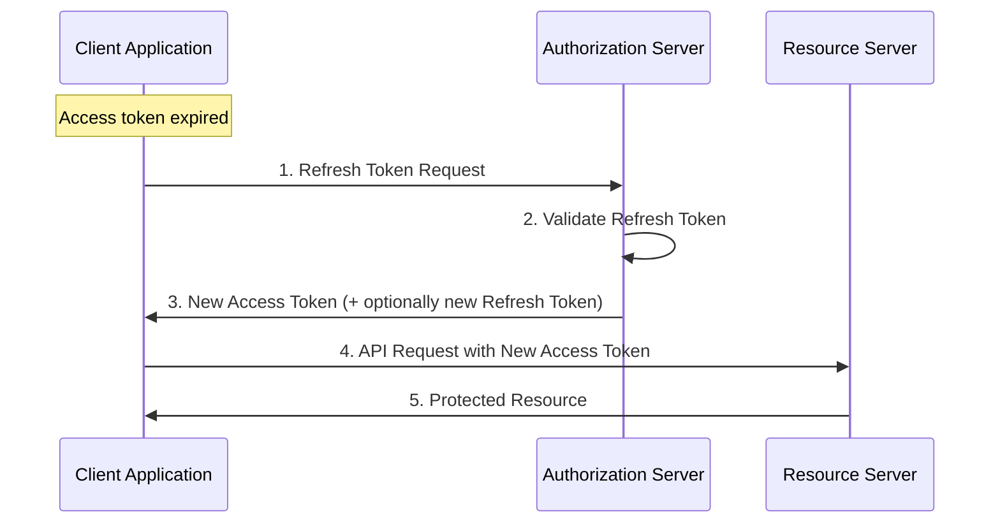

# OAuth 2.0 Flows - Complete Guide

This document provides a comprehensive overview of the most commonly used OAuth 2.0 authorization flows, including visual diagrams and detailed explanations for each flow.

## Table of Contents

1. [Authorization Code Flow](#authorization-code-flow)
2. [Authorization Code Flow with PKCE](#authorization-code-flow-with-pkce)
3. [Client Credentials Flow](#client-credentials-flow)
4. [Implicit Flow](#implicit-flow)
5. [Device Authorization Flow](#device-authorization-flow)
6. [Resource Owner Password Credentials Flow](#resource-owner-password-credentials-flow)
7. [Refresh Token Flow](#refresh-token-flow)
8. [Flow Comparison Table](#flow-comparison-table)
9. [Security Considerations](#security-considerations)

---

## Authorization Code Flow

The **Authorization Code Flow** is the most secure and commonly used OAuth 2.0 flow for web applications that can securely store client secrets.

### Flow Diagram



### Step-by-Step Process

1. **User Initiates Login**: User clicks "Login" in the client application
2. **Redirect to Authorization Server**: Client redirects user to authorization server
3. **Authorization Request**: User's browser makes request to authorization endpoint
4. **Login & Consent UI**: Authorization server presents login and consent forms
5. **User Authentication**: User provides credentials and grants permissions
6. **Authorization Code**: Server redirects back with temporary authorization code
7. **Code Reception**: Client receives the authorization code
8. **Token Exchange**: Client exchanges code + client secret for tokens (backend)
9. **Token Response**: Server returns access token and refresh token
10. **API Request**: Client uses access token to call protected APIs
11. **Resource Response**: Resource server returns protected data
12. **Display to User**: Client displays the retrieved data

### Request Examples

**Authorization Request:**
```http
GET /oauth2/auth?
    response_type=code&
    client_id=demo-app&
    redirect_uri=https://app.example.com/callback&
    scope=openid profile email&
    state=xyz123&
    code_challenge=E9Melhoa2OwvFrEMTJguCHaoeK1t8URWbuGJSstw-cM&
    code_challenge_method=S256
```

**Token Exchange:**
```http
POST /oauth2/token
Content-Type: application/x-www-form-urlencoded

grant_type=authorization_code&
code=AUTH_CODE_HERE&
redirect_uri=https://app.example.com/callback&
client_id=demo-app&
client_secret=CLIENT_SECRET&
code_verifier=dBjftJeZ4CVP-mB92K27uhbUJU1p1r_wW1gFWFOEjXk
```

### Use Cases
- ✅ **Web Applications** with server-side backend
- ✅ **Mobile Applications** (with PKCE)
- ✅ **Single Page Applications** (with PKCE)
- ✅ **Applications requiring high security**

---

## Authorization Code Flow with PKCE

**Proof Key for Code Exchange (PKCE)** is an extension to the Authorization Code Flow to make it secure for public clients (mobile apps, SPAs) that cannot securely store client secrets.

### Flow Diagram



### PKCE Security Enhancement

PKCE adds two cryptographically random values:

- **`code_verifier`**: High-entropy random string (43-128 characters)
- **`code_challenge`**: SHA256 hash of code_verifier (Base64 URL-encoded)

### Request Examples

**Authorization Request with PKCE:**
```http
GET /oauth2/auth?
    response_type=code&
    client_id=mobile-app&
    redirect_uri=com.example.app://callback&
    scope=openid profile&
    state=abc123&
    code_challenge=E9Melhoa2OwvFrEMTJguCHaoeK1t8URWbuGJSstw-cM&
    code_challenge_method=S256
```

**Token Exchange with PKCE:**
```http
POST /oauth2/token
Content-Type: application/x-www-form-urlencoded

grant_type=authorization_code&
code=AUTH_CODE_HERE&
redirect_uri=com.example.app://callback&
client_id=mobile-app&
code_verifier=dBjftJeZ4CVP-mB92K27uhbUJU1p1r_wW1gFWFOEjXk
```

### Use Cases
- ✅ **Mobile Applications** (iOS, Android)
- ✅ **Single Page Applications** (React, Vue, Angular)
- ✅ **Public clients** that cannot store secrets
- ✅ **Desktop applications**

---

## Client Credentials Flow

The **Client Credentials Flow** is used for machine-to-machine authentication where the client itself is the resource owner.

### Flow Diagram



### Request Examples

**Token Request:**
```http
POST /oauth2/token
Content-Type: application/x-www-form-urlencoded
Authorization: Basic base64(client_id:client_secret)

grant_type=client_credentials&
scope=api:read api:write
```

**Alternative (credentials in body):**
```http
POST /oauth2/token
Content-Type: application/x-www-form-urlencoded

grant_type=client_credentials&
client_id=service-app&
client_secret=CLIENT_SECRET&
scope=api:read api:write
```

### Use Cases
- ✅ **Microservices** communicating with each other
- ✅ **Backend services** accessing APIs
- ✅ **Scheduled jobs** and automation
- ✅ **Service-to-service** authentication
- ❌ **NOT for user authentication**

---

## Implicit Flow

The **Implicit Flow** was designed for public clients but is now **deprecated** in favor of Authorization Code Flow with PKCE.

### Flow Diagram



### Security Issues
- ⚠️ **Token in URL**: Access token exposed in browser history
- ⚠️ **No refresh tokens**: Cannot obtain new tokens securely
- ⚠️ **CSRF vulnerabilities**: Difficult to implement proper CSRF protection
- ⚠️ **Token leakage**: Risk of token exposure to malicious scripts

### Migration Recommendation
**Use Authorization Code Flow with PKCE instead** for all new applications.

---

## Device Authorization Flow

The **Device Authorization Flow** is designed for devices with limited input capabilities (smart TVs, IoT devices, CLI tools).

### Flow Diagram



### Request Examples

**Device Authorization Request:**
```http
POST /oauth2/device_authorization
Content-Type: application/x-www-form-urlencoded

client_id=tv-app&
scope=openid profile
```

**Device Authorization Response:**
```json
{
  "device_code": "GmRhmhcxhwAzkoEqiMEg_DnyEysNkuNhszIySk9eS",
  "user_code": "WDJB-MJHT",
  "verification_uri": "https://auth.example.com/device",
  "verification_uri_complete": "https://auth.example.com/device?user_code=WDJB-MJHT",
  "expires_in": 1800,
  "interval": 5
}
```

**Token Polling:**
```http
POST /oauth2/token
Content-Type: application/x-www-form-urlencoded

grant_type=urn:ietf:params:oauth:grant-type:device_code&
device_code=GmRhmhcxhwAzkoEqiMEg_DnyEysNkuNhszIySk9eS&
client_id=tv-app
```

### Use Cases
- ✅ **Smart TVs** and streaming devices
- ✅ **IoT devices** with limited input
- ✅ **Command line tools** and CLI applications
- ✅ **Gaming consoles**
- ✅ **Embedded devices**

---

## Resource Owner Password Credentials Flow

The **Resource Owner Password Credentials (ROPC) Flow** allows applications to directly use user credentials. This flow is **strongly discouraged** for security reasons.

### Flow Diagram



### Security Issues
- ❌ **Credential exposure**: Client application handles user passwords
- ❌ **No consent mechanism**: Users cannot control scope
- ❌ **Trust requirement**: High trust relationship needed
- ❌ **Limited flexibility**: Cannot support MFA or federated login

### When to Use (Rarely)
- Legacy system migration only
- Highly trusted first-party applications
- When other flows are technically impossible

---

## Refresh Token Flow

The **Refresh Token Flow** allows clients to obtain new access tokens using refresh tokens without user interaction.

### Flow Diagram



### Request Examples

**Refresh Token Request:**
```http
POST /oauth2/token
Content-Type: application/x-www-form-urlencoded

grant_type=refresh_token&
refresh_token=REFRESH_TOKEN_HERE&
client_id=demo-app&
client_secret=CLIENT_SECRET&
scope=openid profile email
```

**Response:**
```json
{
  "access_token": "new_access_token_here",
  "token_type": "bearer",
  "expires_in": 3600,
  "refresh_token": "new_refresh_token_here",
  "scope": "openid profile email"
}
```

### Security Best Practices
- ✅ **Rotate refresh tokens** on each use
- ✅ **Set expiration times** for refresh tokens
- ✅ **Implement token binding** when possible
- ✅ **Secure storage** of refresh tokens
- ✅ **Revocation capability** for compromised tokens

---

## Flow Comparison Table

| Flow | Client Type | User Interaction | Security Level | Use Case |
|------|-------------|------------------|----------------|----------|
| **Authorization Code** | Confidential | Required | High | Web apps with backend |
| **Authorization Code + PKCE** | Public | Required | High | Mobile apps, SPAs |
| **Client Credentials** | Confidential | None | Medium | Service-to-service |
| **Implicit** | Public | Required | Low (Deprecated) | Legacy SPAs |
| **Device Authorization** | Public/Limited | Required (separate device) | Medium | IoT, Smart TVs |
| **ROPC** | Any | Required | Low (Discouraged) | Legacy migration |
| **Refresh Token** | Any | None | Medium | Token renewal |

## Security Considerations

### General Security Best Practices

1. **Always use HTTPS** in production
2. **Validate redirect URIs** strictly
3. **Implement proper CSRF protection**
4. **Use short-lived access tokens** (15-60 minutes)
5. **Implement token rotation** for refresh tokens
6. **Store tokens securely** (avoid localStorage for sensitive tokens)
7. **Validate token scopes** on resource servers
8. **Implement rate limiting** on token endpoints
9. **Log and monitor** authentication events
10. **Use PKCE** for all public clients

### Token Storage Recommendations

| Client Type | Access Token Storage | Refresh Token Storage |
|-------------|---------------------|----------------------|
| **Web App (Server-side)** | Session/Memory | Secure HTTP-only cookie |
| **SPA** | Memory only | Secure HTTP-only cookie |
| **Mobile App** | Secure keystore | Secure keystore |
| **Desktop App** | Memory/Secure storage | Secure storage |

### Scope Design

Design scopes to follow the **principle of least privilege**:

```
api:read          # Read access to API
api:write         # Write access to API
api:admin         # Administrative access
profile:read      # Read user profile
profile:write     # Update user profile
openid            # OIDC authentication
```

---

## Conclusion

OAuth 2.0 provides multiple flows to accommodate different application types and security requirements. The **Authorization Code Flow with PKCE** has become the gold standard for most applications, while **Client Credentials Flow** serves machine-to-machine scenarios.

**Recommended Flows:**
- 🥇 **Authorization Code + PKCE**: For all user-facing applications
- 🥈 **Client Credentials**: For service-to-service authentication
- 🥉 **Device Authorization**: For limited-input devices

Always prioritize security over convenience, and stay updated with the latest OAuth 2.1 and security best practices.

---

*For implementation examples using this authentication stack, see the [main README](../README.md) and configuration files in the `configs/` directory.*
